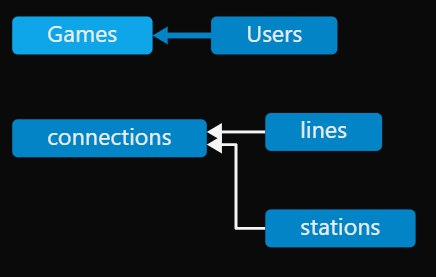
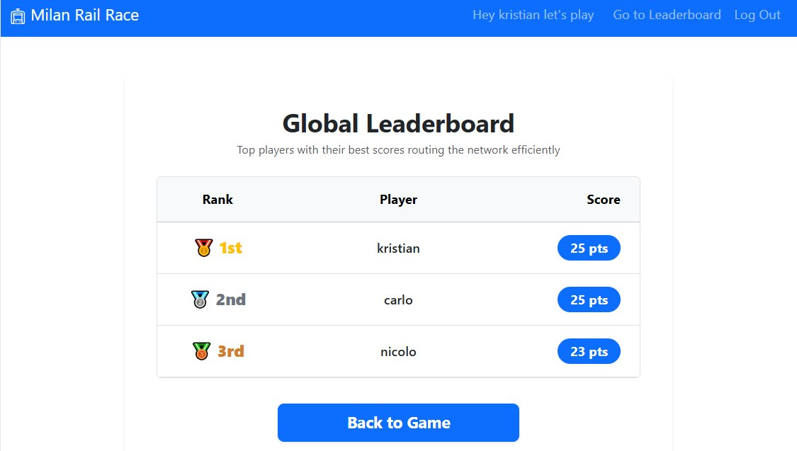
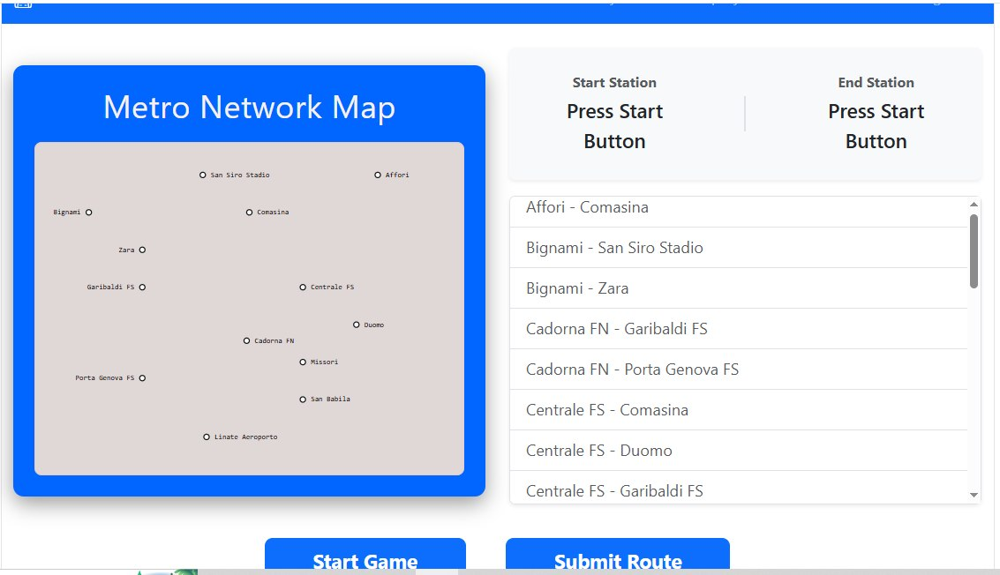

# Exam 1: "Last Race"
## Student: s354274 Prendi Kristian 

## React Client Application Routes

- Route `/`: Landing page, the page showing the rules of the game to all the users (registered or not)
- Route `/setup`: After user logs in, he lands to this page where he can see all the stations + connections between them
- Route `/playGame`: Here the user can actually start the game, he can see the segments from where he can pick them too, and also see the stations.
- Route `submit/:segmentslength`: After timer runs out, or user submits the game connections, if they are valid then we go to this page, where segmentslength param is the number of segments the user picked. This number is used to retrieve random events from server.
- Route `/leaderboard`: Shows the general raning page. The best scores from each user.
- Route `/login`: Redirects the user to a login form.

## API Server

- POST `/api/sessions` - Authenticates a user using a username and password (Local Strategy) and creates a session.
   - Parameters: None.

   - Exchanged Objects:

    Request Body (JSON): 
    { "username": "user123", "password": "password123" }

    Response Body (201 Created): Returns the authenticated user object (e.g., { "id": 1, "username": "user123" }).

    Response Body (401 Unauthorized): { "message": "Incorrect username or password." }

- GET `/api/sessions/current` - Retrieves the information of the currently logged-in user.
  - Parameters : None
  - Exchanged Objects:

    Response Body (200 OK): The active user object (e.g., { "id": 1, "username": "user123" }).

    Response Body (401 Unauthorized): { "error": "Not authenticated" }

- DELETE `/api/sessions/current` - Logs out the current user and terminates their active session.
  - Parameters : None
  - Exchanged Objects:

    Response Body (200 OK): Empty response body (ends the connection).

- NOTE: All APIs below require the user to be authenticated (isLoggedIn). If not authenticated, they return 401 Unauthorized with { "error": "Not authorized" }.

- GET `/api/stations` - Retrieves a list of all railway stations.
  - Parameters : None
  - Exchanged Objects:

    Response Body (200 OK): An object of station objects (e.g., { "1" : { "name": "San Siro", "cx": 136, "cy": 60, "align": start }, ... }).

- GET `/api/connections` - Retrieves all active connections between stations.
  - Parameters : None
  - Exchanged Objects: 

    Response Body (200 OK): An array of connection objects. ["ST1 - ST2", ...]

- GET `/api/start-game` - Randomly picks a valid starting station and an available destination station to initialize a new game route challenge. The stations are at least 3 segments apart.
  - Parameters : None
  - Exchanged Objects: 

    Response Body (200 OK): 
    {
    "nameStartStation": "Station A Name",
    "nameEndStation": "Station B Name"
    }

- POST `/api/verify-route` - Validates whether a route submitted by the user correctly links the assigned start station to the destination station using the network graph.
  - Parameters : None
  - Exchanged Objects: 

    Request Body (JSON): 
    {
    "submittedRoute": ["StationA - StationB", "StationB - StationC", ...],
    "assignedStart": "StationA",
    "assignedDest": "StationC"
    }

    Response Body (200 OK):
    {
      "success": true, // or false
      "message": "Validation status or error explanation"
    }

- POST `/api/users/:id/record-score` - Records a player's earned points in the database.
  - Parameters : id -> The unique id of the user
  - Exchanged Objects: 
      Request Body (JSON): 
        { "pointsEarned": 150 }

    Response Body (200 OK):
    { "success": true, "data": "Database record confirmation details" }

- POST `/api/events` - Fetches a specific number of random in-game events.
  - Parameters: None
  - Exchanged Objects: 
    
    Request Body (JSON):
      { "numberOfEvenets": 3 }

    Response Body (200 OK): An object containing the requested random events.

- GET `/api/scores` - Retrieves the high scores or leaderboards list.
  - Parameters: None
  - Exhanged Objects: 

    Response Body (200 OK): An array of objects ({userId: .., "username": ... , "score": ...})containing registered game scores.

## Database Tables

- Table `users` - contains name, surname, email, hashedPassword and salt of a user + unique auto incremented id
- Table `events` - contains the events, each event has a description, effect and autoincremented id.
- Table `stations` - contains the name of stations + unique autoincremented ids. Each stations has x, y coordonates for putting them in the HTML SVG.
- Table `lines` - contains the name of each line + their colour
- Table `connections`- contains all the connections possible between stations (unidirected). Also it has an id_line to see which line connection takes part of.
- Table `Games` -  record the scores for each game of the logged in user.

## Main React Components

- `NetworkMap` (in `NetworkMap.jsx`): It renders an SVG Map of the Metro Station
- `RulesDisplayer` (in `RulesDisplayer.jsx`): Serves as the Landing page and Shows a list of rules for the game
- `PlayPage` (in `PlayPage.jsx`) : The most important component, where the user actually starts playing. Contains a Network Map without lines, a timer, a list of all selectable connections and of course header + buttons to navigate the game.
- `Leaderboard` (in `Leaderboard.jsx`) : Shows a ranking list of the best scores from each user.

There are 8 components in total, but these 4 are the main ones, because SetupPage.jsx for example is made of NetworkMap and a button, while Header.jsx is just a Header with the title and some navigation links.

## Screenshot

## Users Credentials

- email: kristianprendi29@gmail.com, password: kristian 
- email: carlo@gmail.com , password: carlo 
- email: nicolo@gmail.com, password: nicolo

## Use of AI Tools

Yes, I have used AI tools for this project. In the first place I used it to generate some rules for the game.
I used AI to generate scripts (with data i gave him to) in order to populate my tables. Furthermore, I have used it as a consultant, meaning if there was an error I have not seen in my life I checked with AI to see the error meaning, what was wrong with my code and how it could be improved. Also, I am not a big fan of CSS and I find it very difficult to make the interfaces user-friendly enough, so I have used AI to make my components more user-friendly by applying CSS to them so the interface looks better.
To sum it up, during developemnt I have used Copilot too, which sometimes were good in writing repetitive code (like in the case of db = (...)) and saved a lot of time , but sometimes was not good on writing the objects i want to return from  my API endpoints, so here was a part when I should adapt the outputs the way I want.
